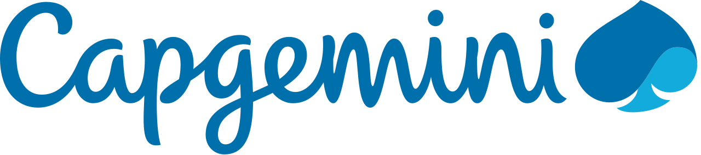

<p align="center">
  
</p>

# Lab 3 — AI Agents Tech · Capgemini COMEX

> **Build your own working AI agent in one morning.** Starter repository for the *AI Agents Tech* lab — Capgemini COMEX.

You will leave this lab with **your own working agent**, not a slide deck. You'll design it through a guided conversation, create it as a file in this repo, run it on real tasks, watch it learn from your feedback — and showcase its output in a branded frontend at the final demo.

---

## The lab flow

| Step | What happens | What powers it |
| --- | --- | --- |
| 1. **Theory** | What an agent *is* — the "new hire" metaphor (instructions = rulebook, tools = accesses, memory = experience, skills = training) | [`docs/good-practices.md`](docs/good-practices.md) · instructor demo in `demos/` |
| 2. **Design** | A guided chat interviews you about the agent you want — you answer business questions, Claude handles the tooling | `agent-builder` skill |
| 3. **Create** | Your agent is generated as a markdown file in your local repo | `.claude/agents/<your-agent>.md` |
| 4. **Run & iterate** | Run it on real tasks; after each run it asks 2 questions and **records what it learns** | `self-improve` skill · `memory/` |
| 5. **Showcase** | Turn its outputs into a polished, Capgemini-branded page for the demo | `showcase` + `frontend-design` + `capgemini-brand` skills |

**No idea, or stuck?** Two pre-defined agents are ready in `.claude/agents/`:

- **`cv-scorer`** — automatically reviews applicants' CVs against a given job offer (data included).
- **`press-release`** — produces a high-quality press release based on competitor information.

---

## The deal

- **Time budget:** 45 min framing · 2h15 build.
- **Primary agent:** [Claude Code](https://www.anthropic.com/claude-code) (Claude Opus / Sonnet 4.6).
- **Mindset:** *A finished project beats an impressive but incomplete one.* This is **production thinking** — not "vibe coding". You care about data, security, quality, maintainability, and knowing the limits of the tools.
- **Reproducible, not one-off:** structure your agent so it can re-run reliably with clear inputs — production thinking, not a one-shot demo.

---

## Data & briefs (`projects/`)

The project folders hold the **data and briefs** behind the pre-defined agents, plus a stretch use case. Each has its own `README.md`.

| Project | Folder | What it feeds | Data |
| --- | --- | --- | --- |
| **Talent** — CV scoring | [`projects/1-talent-cv-scoring`](projects/1-talent-cv-scoring) | The `cv-scorer` agent: score & rank CVs against the sales job offer | 116 anonymized sales CVs + matched job offer (provided) |
| **Radar** — Press ⭐ | [`projects/2-radar-press-synthesis`](projects/2-radar-press-synthesis) | The `press-release` agent & press briefings | Public news (Tavily / web search) |
| **Deck** — Professional PPTX | [`projects/3-deck-pptx-creation`](projects/3-deck-pptx-creation) | Stretch: turn any agent output into an executive deck | Another agent's output + brand tokens |

⭐ = demonstrable end-to-end with public data, no internal Capgemini data required.

---

## Quick start

```bash
# 1. Install tooling (Node 20+) — or just ask Claude Code to "kick off the lab"
npm install
npm --prefix web install

# 2. Configure API keys (optional — only for the news/web fetch scripts)
cp .env.example .env
#   then fill in TAVILY_API_KEY / EXA_API_KEY / NEWSAPI_KEY

# 3. Open the repo with Claude Code
claude

# 4. Inside Claude Code, start designing your agent:
#    "I want to build my agent."           → guided interview (agent-builder skill)
#    …or adopt a pre-defined one:
#    "Run the cv-scorer agent on the sales job offer."
#    "Use the press-release agent: react to <competitor>'s latest announcement."
```

The welcome page at `http://localhost:3000` (after `npm run web:dev`) walks participants
through the same steps on screen.

## Check it works

Before the lab, confirm the repo runs on your machine: `npm test` (a Node self-test, exits 0
when everything's in place) then `npm run web:dev` (boot the app, see the lab title). Full
2-step protocol — runnable from the Claude app too — in [`TESTING.md`](TESTING.md).

## Skills (bundled — no download)

All skills live **inside this repo** under `.claude/skills/` and are loaded automatically by Claude Code. **Nothing to install, nothing to download from a marketplace** — clone the repo and they're there.

| Skill | What it's for |
| --- | --- |
| **agent-builder** | Guided interview → generates *your* agent as a file in `.claude/agents/`. |
| **self-improve** | After every run: 2 feedback questions → learnings saved to `memory/` (long-term memory). |
| **showcase** | End-of-lab demo frontend built from your agent's outputs (uses frontend-design + capgemini-brand). |
| **capgemini-brand** | Capgemini editorial voice + visual identity for anything client-facing. |
| **test-repo** | One-command environment check (`npm test`), cross-platform macOS/Windows with per-OS fixes. |
| **kick-off** | Install all dependencies and launch the local web app. |
| **cv-scoring** | House-style scoring grid + ranking output (Talent). |
| **press-synthesis** | Raw news → executive briefing (Radar). |
| **deck-builder** | JSON deck spec → themed `.pptx` (Deck). |
| **frontend-design** | Production-grade, non-generic UI generation — use it to present results as a polished HTML dashboard or web view. *(Vendored from Anthropic's official plugin, Apache-2.0 — see `.claude/skills/frontend-design/LICENSE`.)* |
| **pdf-reading** | Read/extract text from any PDF on-device (CVs, any reference doc) — standalone via `npm run read:pdf`, no network or Python. |
| **nda-analysis** | Review an NDA/contract, **cross-check company memory**, write a one-page risk report. Powers the memory × skill demo (see `demos/`). |
| **brainstorming** | Turn a fuzzy idea into an agreed design through one-question dialogue *before* building. *(Vendored & trimmed from the superpowers plugin.)* |
| **teach** | Quiz you on a topic and build lessons/diagrams. **Invoke by name** (`/teach <topic>`) — it won't auto-trigger. *(Vendored from Matt Pocock's skills.)* |

This repo is **fully self-contained**: no external plugin marketplace is required. The new
skills were **vendored locally** (copied in, with provenance) precisely so nothing has to be
downloaded on lab day — see [`references/`](references/) for the originals they're based on.

---

## Network & data — for IT review

What this repo needs to reach the network, and what stays local:

| Capability | Network needed? | Notes |
| --- | --- | --- |
| `npm install` (root) | Yes, once | npm registry. Pinned via `package-lock.json`. Deps: `pptxgenjs`, `pdfjs-dist`, `tsx`, `typescript`, `@types/node` (0 known vulnerabilities). |
| `npm --prefix web install` (front-end) | Yes, once | npm registry. ~28 packages (`next`, `react`, `react-dom`), pinned via `web/package-lock.json`. **Pre-install on participant machines** alongside the CV data. 2 moderate transitive advisories, acceptable for a local lab. |
| Claude Code itself | Yes | `api.anthropic.com` — the agent engine. |
| **Deck** project | **No** (offline) | Renders `.pptx` fully locally via `pptxgenjs`. |
| **Talent** project | **No** for data | CVs are local PDFs read on-device. Scoring is done by Claude. |
| PDF reading (`read:pdf`) | **No** (offline) | Local text extraction via pdf.js — no network, no Python. |
| **Radar** project | Yes | Public news (Tavily / NewsAPI, or Claude's web search). |
| Web front-end (`web/`) | **No** at runtime | Reads local `projects/*/output/` only; no network once installed. |
| Skills (incl. frontend-design, nda-analysis, brainstorming, teach) | **No** | All bundled in the repo — no marketplace, no plugin install. |
| References (`references/`) | **No** | Karpathy CLAUDE.md + knowledge-work legal prose are vendored copies — no download. |

**Data handling:** all data in this repo is **public or synthetic**. The `data/cvs/` PDFs are a public, anonymized résumé dataset (PII redacted — see its [README](projects/1-talent-cv-scoring/data/cvs/README.md)); job descriptions and proxy CVs are synthetic. Capgemini's brand essentials are summarized in [`capgemini-brand.md`](projects/3-deck-pptx-creation/brand/capgemini-brand.md) (the full 45 MB brand PDF is intentionally **not** bundled, to keep clones lean). The NDA in `demos/nda-review/` is a **fictional** sample for the memory demo. **No real or internal Capgemini candidate/business data is included.** No secrets are committed (`.env` is git-ignored; only `.env.example` with empty placeholders ships).

---

## Repository layout

```
.
├── CLAUDE.md                  # Project context Claude Code reads on every session
├── .claude/
│   ├── settings.json          # Permissions for the lab
│   ├── agents/                # Agents live HERE — yours will too
│   │   ├── cv-scorer.md       # pre-defined: CVs vs job offer
│   │   └── press-release.md   # pre-defined: PR from competitor info
│   └── skills/                # Bundled skills — no download needed
│       ├── agent-builder/     # interview → your agent file
│       ├── self-improve/      # feedback → long-term memory
│       ├── showcase/          # end-of-lab demo frontend
│       ├── capgemini-brand/   # editorial voice + visual identity
│       ├── test-repo/         # env check (npm test), Mac/Windows
│       ├── kick-off/          # install deps + dev server
│       ├── cv-scoring/
│       ├── press-synthesis/
│       ├── deck-builder/
│       ├── frontend-design/   # vendored (Anthropic, Apache-2.0)
│       ├── pdf-reading/       # read PDFs on-device, standalone
│       ├── nda-analysis/      # review an NDA + cross-check memory
│       ├── brainstorming/     # vendored & trimmed (superpowers)
│       └── teach/             # vendored (Matt Pocock) — invoke by name
├── memory/                    # Long-term memory — grows as your agent learns
├── projects/                  # Data & briefs behind the agents
│   ├── 1-talent-cv-scoring/   # data/cvs/ = 116 anonymized PDF CVs
│   ├── 2-radar-press-synthesis/
│   └── 3-deck-pptx-creation/  # incl. Capgemini brand tokens (brand/)
├── web/                       # Minimal Next.js front-end — renders each project's output/
├── demos/                     # Instructor-only: the memory × skill (NDA) live demo
│   └── nda-review/            #   memory/ + a fictional NDA + output/
├── references/                # Vendored reading: Karpathy CLAUDE.md · knowledge-work legal
├── scripts/                   # Helpers: fetch-news, build-deck (tsx) · read-pdf (node)
└── docs/
    └── good-practices.md      # The production reflexes we voice-over during the build
```

**Front-end:** `npm run web:dev` boots the Next.js app at `http://localhost:3000`; each route
renders a project's `output/`. It's deliberately plain — upgrade it live with `frontend-design`.

**Reference to steal from:** [`references/karpathy-CLAUDE.md`](references/karpathy-CLAUDE.md) — a
short, high-signal `CLAUDE.md` to model your own agent rulebook on.

---

## Before you ship

Read [`docs/good-practices.md`](docs/good-practices.md). The one-page checklist on data, security and "is this production?" is the difference between a demo and something you'd actually run.

---

*Lab team: Louis (lead) · Nathan · Arnaud — IQ for Capgemini.*
